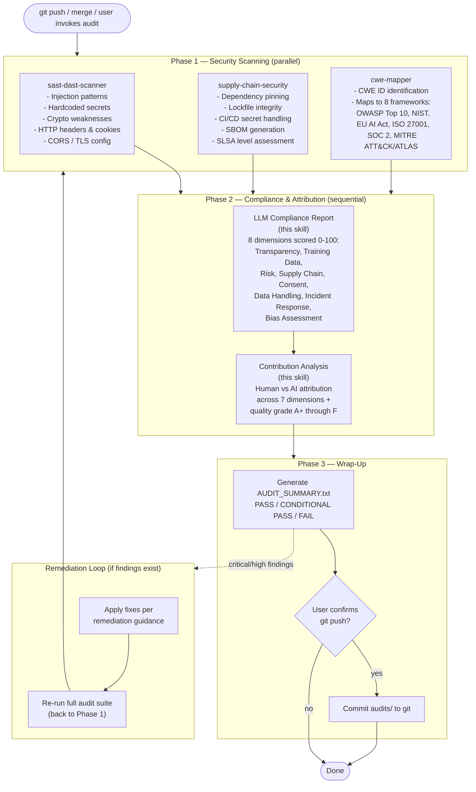
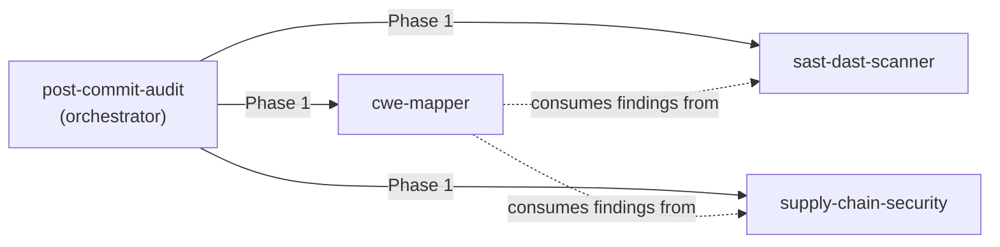

# Post-Commit Audit

A unified orchestration skill that runs a full security-and-compliance audit suite after every major git check-in. This is the standard quality gate — no code ships without being scanned, classified, mapped to compliance frameworks, and attributed.

## What It Does

The skill runs 5 audits across 3 phases, producing reports in an `audits/` directory:

| # | Report | Produced By | Output File |
|---|--------|-------------|-------------|
| 1 | SAST/DAST Scan | `sast-dast-scanner` | `audits/sast-dast-scan.md` |
| 2 | Supply Chain Audit | `supply-chain-security` | `audits/supply-chain-audit.md` |
| 3 | CWE Mapping | `cwe-mapper` | `audits/cwe-mapping.md` |
| 4 | LLM Compliance Report | this skill | `audits/llm-compliance-report.md` |
| 5 | Contribution Analysis | this skill | `audits/contribution-analysis.md` |

Plus a summary index: `audits/AUDIT_SUMMARY.txt`

## Orchestration Flow



## Skills Called

This skill orchestrates three external security scanner skills:



If any scanner skill is missing, the audit can still run — `post-commit-audit` contains enough context to perform each scan manually. The dedicated skills just do it better and faster.

## Installation

Clone the repo into your Claude Code plugins directory:

```bash
git clone git@github.com:justice8096/post-commit-audit.git \
  ~/.claude/plugins/post-commit-audit
```

Or add it alongside the dependent scanner skills:

```bash
# Recommended: install the full suite
git clone git@github.com:justice8096/sast-dast-scanner.git     ~/.claude/plugins/sast-dast-scanner
git clone git@github.com:justice8096/supply-chain-security.git  ~/.claude/plugins/supply-chain-security
git clone git@github.com:justice8096/cwe-mapper.git             ~/.claude/plugins/cwe-mapper
git clone git@github.com:justice8096/post-commit-audit.git      ~/.claude/plugins/post-commit-audit
```

Claude Code auto-discovers skills in `~/.claude/plugins/`. No further configuration needed.

## Usage

Run the audit via the skill trigger phrases:
- "run the full audit"
- "post-commit audit"
- "audit this commit"
- "full security pass"

Or use the shell script directly:

```bash
# Basic audit
./skills/post-commit-audit/scripts/run-audit-suite.sh /path/to/project

# Audit + auto-fix findings
./skills/post-commit-audit/scripts/run-audit-suite.sh /path/to/project --fix

# Audit + commit results to git
./skills/post-commit-audit/scripts/run-audit-suite.sh /path/to/project --push
```

## Project Structure

```
skills/post-commit-audit/
  SKILL.md                                    # Skill definition and full audit sequence
  references/
    llm-compliance-template.md                # 8-dimension scoring rubric (EU AI Act, NIST, ISO 27001, SOC 2)
    contribution-analysis-template.md         # Human vs AI attribution matrix template
  scripts/
    run-audit-suite.sh                        # Shell orchestrator for the 5-audit pipeline
```

## License

MIT
